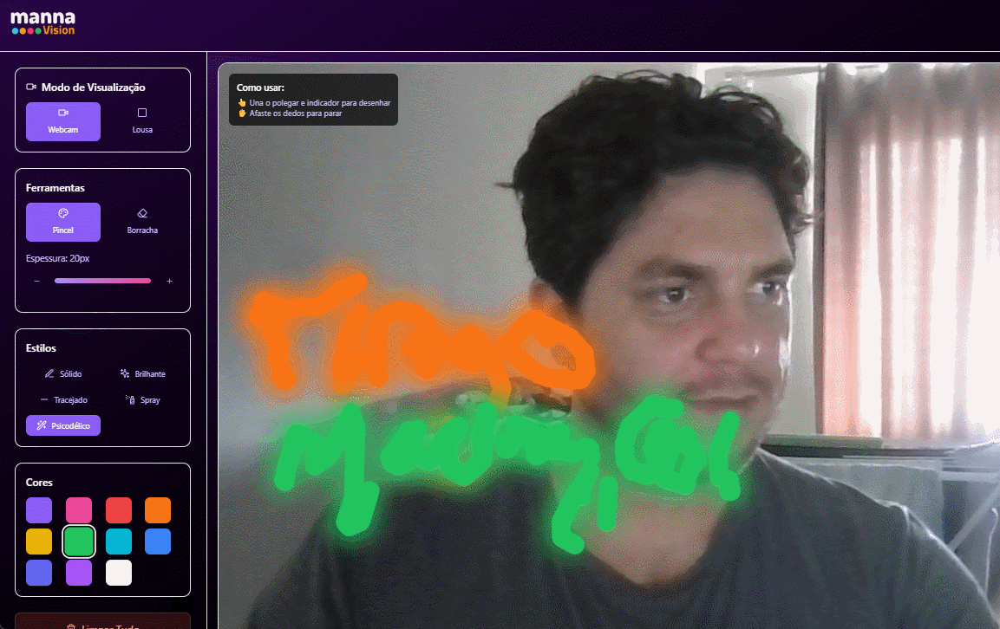

<h1 align="center">MannaVision ✨</h1>

<p align="center">
  <strong>Desenhe no ar com suas mãos e transforme suas ideias em arte com IA! Uma aplicação web que une gestos humanos e criatividade artificial.</strong>
</p>

<p align="center">
  
  
  
  
</p>

---

## 📖 Sobre o Projeto

MannaVision é mais do que uma tela de pintura digital; é uma ponte entre a expressão humana e a geração de imagens por Inteligência Artificial. A aplicação começou como uma exploração da interação humano-computador, permitindo aos usuários desenhar de forma intuitiva usando gestos de mão rastreados em tempo real pela IA do **MediaPipe Hands**.

Agora, o projeto evoluiu. Além de ser uma ferramenta de desenho gestual, MannaVision integra um poderoso **módulo de IA Generativa**. Com um simples comando de texto, você pode transformar uma ideia ou inspiração em uma obra de arte única e detalhada, gerada pela IA da **Hugging Face**.

<br>

  
*(Nota: O GIF acima mostra a funcionalidade de desenho original. A nova funcionalidade de IA complementa esta experiência.)*

---

## 🚀 Funcionalidades Principais

### Ferramentas de Desenho Interativo
- ✍️ **Desenho por Gestos**: Ative o pincel unindo o polegar e o indicador.
- ✌️ **Suporte para Duas Mãos**: Detecta e rastreia até duas mãos simultaneamente.
- 🎨 **5 Estilos de Pincel Criativos**: Escolha entre **Sólido**, **Brilhante**, **Spray**, **Tracejado** e o dinâmico **Psicodélico**.
- 🎨 **Paleta de Cores e Ferramentas**: Controle total com seletor de cores, ajuste de espessura e modo borracha.
- 🎨 **Temas de Interface**: Personalize a aparência com 4 temas (Roxo, Azul, Verde e Rosa).
- 📋 **Modo Lousa**: Alterne para um fundo branco para uma experiência de desenho mais tradicional.

### Módulo de IA Generativa
- 🤖 **Geração de Arte com IA**: Clique no botão "Gerar Imagem com IA" para abrir um modal.
- 📝 **Prompt de Texto**: Descreva a imagem que você deseja criar em um modal interativo no rodapé da tela.
- 🖼️ **Visualização em Modal**: A imagem gerada pela IA aparece em um modal centralizado, com opções para fechar ou salvar.
- 💾 **Salvar Arte da IA**: Baixe as criações da IA diretamente para o seu dispositivo.

### Exportação
- **Salvar Desenho**: Exporte apenas a sua arte gestual em `.png` com fundo transparente.
- **Salvar Recordação**: Capture um "print" da tela, mesclando sua webcam, o desenho e a logo do MannaVision.

---

## 🛠️ Tecnologias Utilizadas

Este projeto combina um frontend moderno com um backend leve para se comunicar com APIs de IA.

| Categoria                 | Tecnologia         | Descrição                                                                 |
| :------------------------ | :----------------- | :------------------------------------------------------------------------ |
| **Frontend**              | **React**          | Biblioteca principal para a construção da interface do usuário.            |
|                           | **TypeScript**     | Superset do JavaScript que adiciona tipagem estática.                      |
|                           | **Vite**           | Ferramenta de build de nova geração para desenvolvimento web.              |
|                           | **Tailwind CSS**   | Framework CSS utility-first para estilização rápida e moderna.             |
| **Backend**               | **Python**         | Linguagem utilizada para criar o servidor que se comunica com a IA.        |
|                           | **Flask**          | Micro-framework web para criar a API do backend de forma simples.          |
| **Inteligência Artificial** | **MediaPipe Hands** | Solução do Google para rastreamento de mãos em tempo real.               |
|                           | **Hugging Face API** | Plataforma que fornece acesso gratuito a modelos de IA Generativa.         |
| **Ferramentas de Dev**    | **concurrently**   | Ferramenta para executar frontend e backend com um único comando.          |

---

## ⚙️ Instalação e Execução Local

Para executar o projeto completo (Frontend + Backend + IA) em sua máquina, o processo foi unificado.

### Pré-requisitos
- [Node.js](https://nodejs.org/) (versão 16 ou superior)
- [Python](https://www.python.org/downloads/) (versão 3.8 ou superior)
- [Git](https://git-scm.com/)

### Passos

1. **Clone o repositório:**
    ```bash
    git clone https://github.com/tmadrigar/MannaVision.git
    cd MannaVision
    ```

2. **Instale as dependências do Frontend:**
    ```bash
    npm install
    ```

3. **Configure o Backend em Python:**
    * Crie e ative um ambiente virtual. Isso isola as dependências do seu projeto.
    ```bash
    # Cria o ambiente virtual
    python -m venv .venv

    # Ativa o ambiente (Windows - PowerShell)
    .\.venv\Scripts\Activate.ps1

    # Ativa o ambiente (macOS/Linux)
    source .venv/bin/activate
    ```
    * Crie um arquivo chamado `requirements.txt` na raiz do projeto e adicione o seguinte conteúdo:
    ```txt
    Flask
    flask-cors
    requests
    python-dotenv
    ```
    * Instale as dependências do Python:
    ```bash
    pip install -r requirements.txt
    ```

4. **Configure sua Chave de API da Hugging Face:**
    * Crie uma conta gratuita em [huggingface.co](https://huggingface.co) e gere um **Access Token** com permissão **`write`**.
    * Na raiz do projeto, crie um arquivo chamado `.env`.
    * Dentro do arquivo `.env`, adicione a seguinte linha, substituindo pela sua chave:
    ```env
    HUGGING_FACE_TOKEN="hf_suaChaveComPermissaoWriteAqui"
    ```
    * Para garantir que o `app.py` carregue esta chave, adicione estas duas linhas no topo do arquivo `app.py`:
    ```python
    from dotenv import load_dotenv
    load_dotenv()
    ```

5. **Inicie TUDO com um único comando:**
    ```bash
    npm start
    ```
    Este comando usará o `concurrently` para iniciar o servidor de frontend do Vite e o servidor de backend do Flask ao mesmo tempo, no mesmo terminal.

6. **Abra o MannaVision:**
    Abra seu navegador e acesse `http://localhost:5173` (ou a porta indicada no terminal).

---

## ✍️ Autor

**tmadrigar**

Sinta-se à vontade para entrar em contato ou contribuir com o projeto!
